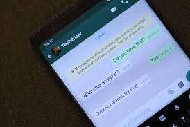

>> ## Whatsapp Text Analyzer
>> 
>> ## About Project or Description
>> I have collect the data from the whatsapp group. And Analyze with data who is the top active user that in whatsapp group. Who is the share the more information that in group. How much similar word is mostly used in whatsapp group. which month is user is most active.
>> * And Count the total word used that in whatsapp group.
>> * Total Count the types of emoji according to the expressions and shared in the whatsapp groups.
>> *  who is the most active in the whatsapp group.
>> * How many person shared the information that in whatsapp groups.

>>> # *Skills*
>>> > # *Programming Language*
>>> > 1. Python
>>> >> # *Python Library*
>>> >> * Pandas
>>> >> * Numpy
>>> >> * Matplotlib
>>> >> * nltk(natural language Tool Kit)
>>> >> >> # *Deployment*
>>> >> >> * Streamlit Library

>>>>>># My LinkedIn Account [click here](https://www.linkedin.com/in/ashok940/)

